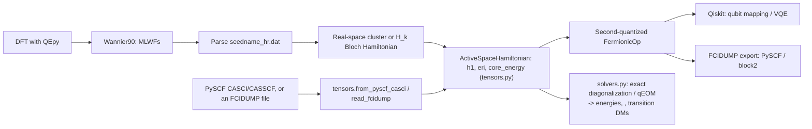
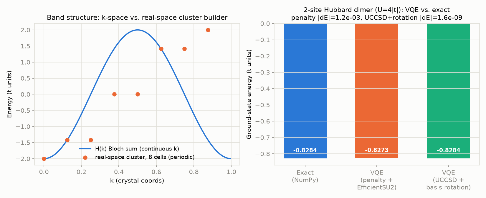

# QIS_QE

### Wannier-Downfolded Hamiltonians from Quantum ESPRESSO for Quantum Algorithms

[](LICENSE)

A generic active-space Hamiltonian core (`tensors.py`) plus two front ends
that build one: a **DFT calculation from Quantum ESPRESSO (via QEpy)** →
**Wannier90** MLWFs → tight-binding hopping matrix, or a **PySCF
CASCI/CASSCF** active space / an **FCIDUMP** file straight from an external
(e.g. embedding) calculation. Either way, the same core turns it into a
**qubit operator** (Qiskit Nature) and/or hands it to an exact-diagonalization
or qEOM solver (`solvers.py`) for ground- and excited-state energies, spin
quantum numbers, and transition density matrices.

**Scope, honestly stated:** the qubit counts current NISQ-era algorithms and
simulators can handle (tens of qubits) limit this to small active spaces —
a handful of Wannier orbitals around the Fermi level, a defect cluster, a
molecular fragment, or a CASCI-sized embedded active space — not full unit
cells of "large materials". See [Limitations](#limitations--known-caveats)
below. This repo is meant to be a generic solver library: project-specific
science (e.g. an embedding driver producing the active-space integrals fed
in here) belongs upstream of it, not inside it.

---

## Workflow



## What's implemented

- **QEpy-driven SCF/NSCF → Wannier90 pipeline** (`wannierize_qepy.py`): writes
  the `.win` file from the QEpy driver's lattice/k-points, runs
  `wannier90.x -pp` → `pw2wannier90.x` → `wannier90.x`, and returns
  `seedname_hr.dat`. Requires QE, Wannier90, and QEpy installed and on
  `PATH` (see [Installation](#installation)) — this part has not been run
  end-to-end against a shipped example in this repo yet.
- **hr.dat parsing** (`ham_builder.read_wannier90_hr`) with strict validation:
  a mismatch between the number of R-vectors and Wigner-Seitz degeneracy
  weights raises instead of silently dropping the weights.
- **k-space Bloch Hamiltonian** `H(k) = Σ_R e^{i2πk·R} H(R)`
  (`kspace_hamiltonian`), with an explicit Hermiticity check: deviations
  above tolerance raise a warning (with the deviation size) instead of being
  silently symmetrized away.
- **Real-space cluster/supercell builder** (`build_cluster_hamiltonian`):
  assembles a finite many-orbital Hamiltonian directly from the H(R) hopping
  blocks, `H[(m,cell_a),(n,cell_b)] = H_mn(cell_b − cell_a)`, with either
  periodic (folded supercell) or open (finite cluster) boundary conditions
  per axis. This is the physically correct way to build an interacting
  problem on real Wannier sites — see
  [Limitations](#limitations--known-caveats) for why building it from a
  single H(k) instead is usually *not* meaningful.
- **Tensor-based core** (`tensors.py`): `ActiveSpaceHamiltonian` holds a
  one-body `h1[p,q]`, a fully general two-body `eri[p,q,r,s]` (chemist
  notation, spin-independent — see the module docstring for why one shared
  tensor across spin sectors is physically correct, not a simplification),
  and a `core_energy`. "Fully general" matters: it's not restricted to
  density-density terms, so exchange and pair-hopping integrals — the ones
  that separate a singlet from a triplet in, say, a CAS(2,2) — are ordinary
  entries of the same tensor (verified against PySCF's FCI on H₂/STO-3G in
  `tests/test_solvers.py`). `ModelSpec`'s `U`/`V_nn`/`mu`/double-counting are
  built into (h1, eri) by `tensors_from_Hk` (which only ever populates the
  density-density entries — a property of the Hubbard-like *model*, not a
  limitation of the tensor itself); `ham_builder.fermionic_from_Hk`/
  `fermionic_from_cluster` are thin, backward-compatible wrappers over this.
- **External-integrals front end** (`tensors.read_fcidump`,
  `tensors.from_pyscf_casci`): builds an `ActiveSpaceHamiltonian` directly
  from a standard FCIDUMP file or a converged PySCF `CASCI`/`CASSCF` object —
  for a general active-space Hamiltonian from a source other than a Wannier
  hr.dat (e.g. an embedding calculation's active space). This is also the
  seam an ab initio Coulomb module plugs into on the Wannier side: it only
  needs to produce an `eri` tensor of the same shape (see `coulomb.py`).
- **Excited-state solvers** (`solvers.py`): `diagonalize_active_space` does
  exact diagonalization within a fixed (n_alpha, n_beta) Fock sector,
  returning energies, `⟨S²⟩` per state, and one-body transition density
  matrices `γ⁰ⁿ_pq = ⟨0|p†q|n⟩` relative to the ground state — cross-checked
  against PySCF's `trans_rdm1` and `spin_op.spin_square`. `filter_singlets`
  drops any non-singlet state using `⟨S²⟩` (a CAS(2,2) generically produces
  triplets interleaved with the singlets you actually want in a coupling
  matrix). `transition_dipole` is the small classical contraction from `γ⁰ⁿ`
  and one-electron dipole integrals to a transition dipole moment — the
  quantum solver never measures a dipole operator itself. `run_qeom` wraps
  qiskit-nature's own QEOM for ground/excited-state *energies* (validated
  against PySCF FCI on H₂/STO-3G); it does not yet expose `⟨S²⟩` or
  transition density matrices per state — see its docstring.
- **Second-quantized model builder** (`fermionic_from_Hk` /
  `fermionic_from_cluster`): one-body hopping, onsite Hubbard `U`,
  nearest-neighbor `V` (with duplicate-bond guarding — `(i,j)` and `(j,i)`
  are the same bond and are no longer double-counted), chemical potential,
  and an optional documented double-counting correction
  (`ModelSpec.dc_scheme="fll"` or `"amf"`, see `double_counting_shift`).
- **Qubit mapping**: Jordan–Wigner, parity (with a correctly wired two-qubit
  reduction via `num_particles`), or Bravyi–Kitaev.
- **VQE**, via either a particle-number penalty (`penalize_number` +
  hardware-efficient ansatz, works in any basis) or a number-conserving
  UCCSD ansatz (`ham_builder.qubit_and_uccsd_from_tensors` — rotates (h1, eri)
  to the one-body eigenbasis first, which UCCSD/HartreeFock require; see
  [Limitations](#limitations--known-caveats) for why that rotation matters).
- **FCIDUMP export** (`tensors.write_fcidump`): writes (h1, eri) in the
  standard format read by PySCF/Molpro/block2, giving access to
  exact-diagonalization (FCI) and DMRG reference calculations at sizes
  Qiskit's statevector simulators can't reach. Cross-checked against PySCF's
  own FCI solver in `tests/test_tensors.py`.
- **Validation**: `benchmarks/h_chain_benchmark.py` checks the real-space
  cluster builder against the k-space Bloch Hamiltonian on a toy chain, and
  compares VQE (both approaches above) against exact diagonalization on a
  small Hubbard dimer. See [Validation](#validation) below.

## Roadmap / not yet implemented

These appeared in earlier drafts of this README as if shipped; they are not,
and are listed here instead so the gap is explicit:

- **Ab initio Coulomb integrals** over the Wannier functions (`coulomb.py` is
  a scaffold with a documented `NotImplementedError` — it needs UNK real-space
  grids and the Wannier90 U-matrix, neither of which is parsed yet, plus care
  with the periodic G=0 Coulomb-kernel divergence). Until this exists,
  `ModelSpec.U`/`V_nn` are hand-set model parameters, not DFT output — see
  [Limitations](#limitations--known-caveats). Once implemented, the
  recommended validation is an isolated H₂-in-a-box run through the full
  pipeline (QE → Wannier90 → `coulomb.eri_from_wannier` → FCI, via
  `tensors.write_fcidump`) compared against a direct PySCF calculation on the
  same molecule — a true end-to-end check, integrals included.
- **Constrained RPA (cRPA)** for a screened U, built on top of the above.
- **EOM-VQE / subspace VQE / Trotter time evolution** — sketched as
  unexecuted imports in `QE_qiskit.ipynb`, not a working code path.
- **Execution on real quantum hardware** (IBM/IonQ/Quantinuum) — not
  connected; everything currently runs on Qiskit's local simulators.
- **Fault-tolerant resource estimation** (double factorization / tensor
  hypercontraction of `eri`) — natural once the tensor core is the source of
  truth, not started.
- **`⟨S²⟩` and transition density matrices from qEOM specifically** — `
  run_qeom` returns energies only; qiskit-nature's QEOM computes the needed
  quantities internally (M/Q/V/W response matrices, expansion coefficients)
  but doesn't expose them as a public per-state result in the pinned version.
  `diagonalize_active_space` already provides both and is the recommended
  solver at the CAS(2,2)-CAS(6,6) scale this module targets — see
  `solvers.run_qeom`'s docstring.

## Validation

`benchmarks/h_chain_benchmark.py` builds a synthetic 1-orbital nearest-neighbor
chain (so it runs without QE/Wannier90 installed) and checks two things:

1. **Band structure**: the real-space cluster builder, diagonalized on an
   8-cell periodic supercell, reproduces the k-space Bloch Hamiltonian
   sampled at the same supercell's allowed k-points to numerical precision.
2. **Interacting ground state**: for a 2-site Hubbard dimer (`U = 4|t|`), VQE
   matches exact diagonalization two ways — particle-number-penalized
   (hardware-efficient ansatz, ~1e-3|t|) and eigenbasis-rotated UCCSD
   (~1e-9|t|, from the zero initial point).



`tests/test_tensors.py` additionally cross-checks the tensor core against an
independent classical solver: writing (h1, eri) to FCIDUMP and re-diagonalizing
with **PySCF's own FCI solver** reproduces the same ground-state energy to
~1e-13.

`tests/test_solvers.py` validates the excited-state solvers on a real
molecular active space — H₂/STO-3G, CAS(2,2), built via
`tensors.from_pyscf_casci` — against PySCF: `diagonalize_active_space`'s
energies and `⟨S²⟩` match PySCF's FCI (`fci.direct_spin1`) exactly (including
correctly flagging the CAS(2,2) triplet, `⟨S²⟩=2`, interleaved among the
singlets), its transition density matrix matches PySCF's `trans_rdm1` up to
the expected transpose convention and an arbitrary eigenvector phase, and
`run_qeom`'s energies match PySCF's FCI to ~2e-4 Hartree with a classical
VQE.

Both `test_tensors.py`'s and `test_solvers.py`'s PySCF cross-checks need
`pip install -e ".[dev,validate]"`; they're skipped otherwise, and everything
else works without PySCF installed.

Run the benchmark yourself: `python benchmarks/h_chain_benchmark.py`.

## Limitations & known caveats

- **U/V are model parameters, not ab initio values.** They are hand-set
  Hubbard-like couplings on top of a DFT-derived tight-binding model, i.e.
  "Wannier tight-binding + model interaction," not a first-principles
  interacting Hamiltonian. See the Roadmap above for what closing this gap
  requires.
- **No double-counting correction is applied by default.** The DFT hoppings
  already contain a mean-field estimate of the interaction (via Hartree +
  exchange-correlation), so adding `U` on top without correcting for that
  double-counts part of it. `ModelSpec.dc_scheme` implements the two standard
  corrections (FLL, AMF; Anisimov et al., PRB 48, 16929 (1993)) — pick one and
  supply `dc_n0` (the nominal DFT occupation per spin-orbital) explicitly;
  there is no safe default to fall back on silently. FLL uses the orbital's
  *total* occupation N=2·n0 (U multiplies n↑n↓ for the whole orbital); AMF
  uses n0 directly. The two agree at half filling (n0=1/2): both give U/2,
  which is also the exact particle-hole-symmetric point of the single-band
  Hubbard model — a useful sanity check if you're changing this code.
- **Building the many-body problem from a single H(k) is usually not
  meaningful.** `fermionic_from_hr`/`fermionic_from_Hk` fold every periodic
  image's hopping into one cell's orbitals; adding a local `U` there is only
  physically sensible if that "cell" already *is* the full interacting region
  you intend (e.g. Γ-point on a hr.dat that already describes a large defect
  supercell). For a primitive-cell hr.dat, or any non-Γ k, use
  `build_cluster_hamiltonian` + `fermionic_from_cluster` instead — it builds
  an explicit real-space cluster with boundary conditions you choose.
- **UCCSD/HartreeFock assume the input orbitals are already the mean-field
  eigenbasis.** Wannier orbitals are a localized basis, not that eigenbasis;
  calling `ham_builder.build_uccsd_ansatz` directly on a Wannier Hamiltonian
  (rather than through `qubit_and_uccsd_from_tensors`) can converge to the
  wrong state — this was hit and diagnosed while building the benchmark
  above (VQE stuck ~0.3|t| above the true ground state). Use
  `qubit_and_uccsd_from_tensors`, which rotates (h1, eri) to the one-body
  eigenbasis first via `tensors.rotate_to_eigenbasis`; that rotation is a
  unitary single-particle basis change, so it doesn't alter the physical
  spectrum (verified in `tests/test_tensors.py`), only which determinant
  counts as the mean-field reference.
- **Unscreened, even once implemented, is not "correct."** A direct Coulomb
  integral over Wannier functions ignores screening from the rest of the
  electrons, typically overestimating `U` by a factor of a few for
  correlated d/f-like orbitals. Treat it as an upper bound / starting point,
  not a final answer, until a cRPA (or similar) screening calculation is
  wired up.

## Installation

```bash
pip install -r requirements.txt   # or: pip install -e .
```

`qiskit`, `qiskit-nature`, and `qiskit-algorithms` are pinned to a
combination that's actually been run together (newer `qiskit` releases
changed the `Estimator` primitive interface in a way that breaks
`qiskit-algorithms<0.4`'s `VQE`) — see `requirements.txt` for the exact
constraint if you need to move off it.

The Wannierization step (`wannierize_qepy.py`) additionally requires, on
`PATH` and installed separately (not on PyPI):
- [Quantum ESPRESSO](https://www.quantum-espresso.org/) (`pw.x`,
  `pw2wannier90.x`) and [QEpy](https://gitlab.com/QEF/qepy) bindings
- [Wannier90](http://www.wannier90.org/) (`wannier90.x`)

Run the tests (no QE/Wannier90/QEpy needed — they use synthetic tight-binding
data):

```bash
pip install -e ".[dev]"
pytest
```

To also run the PySCF cross-check of the tensor core / FCIDUMP export
(optional — everything else works without it):

```bash
pip install -e ".[dev,validate]"
pytest
```

## License

[MIT](LICENSE)
