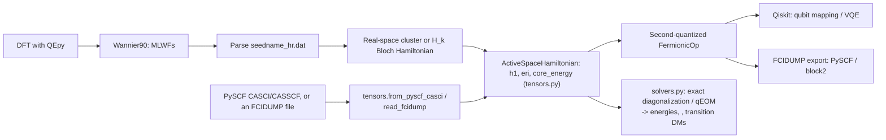
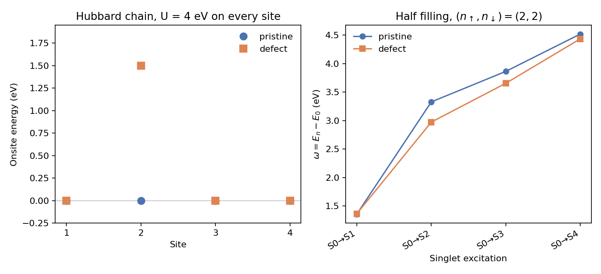
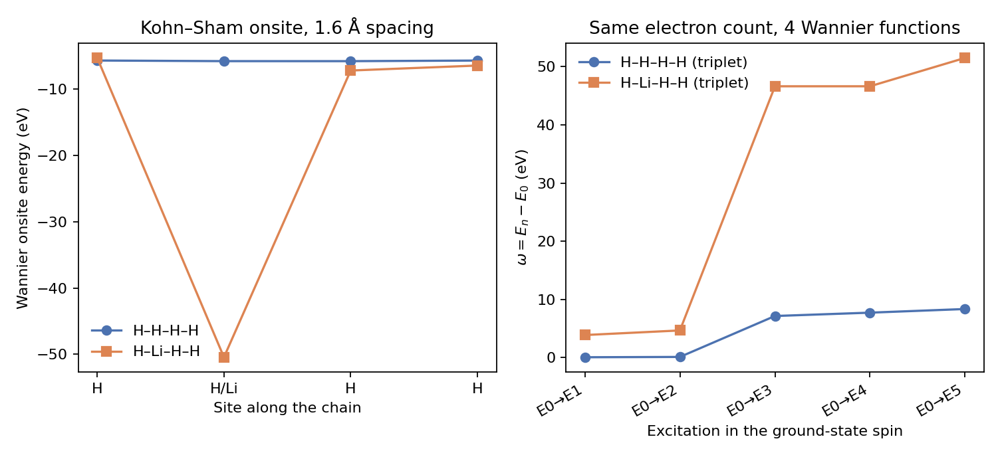
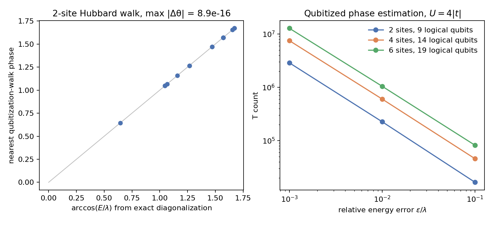

# QIS_QE

### Wannier-Downfolded Hamiltonians from Quantum ESPRESSO for Quantum Algorithms

[](LICENSE)

A generic active-space Hamiltonian core (`tensors.py`) plus two front ends
that build one: a **DFT calculation from Quantum ESPRESSO (via QEpy)** →
**Wannier90** MLWFs → tight-binding hopping matrix, or a **PySCF
CASCI/CASSCF** active space / an **FCIDUMP** file straight from an external
(e.g. embedding) calculation. Either way, the same core turns it into a
**qubit operator** (Qiskit Nature) and/or hands it to an exact-diagonalization
or qEOM solver (`solvers.py`) for ground- and excited-state energies, spin
quantum numbers, and transition density matrices.

**Scope, honestly stated:** the qubit counts current NISQ-era algorithms and
simulators can handle (tens of qubits) limit this to small active spaces —
a handful of Wannier orbitals around the Fermi level, a defect cluster, a
molecular fragment, or a CASCI-sized embedded active space — not full unit
cells of "large materials". See [Caveats and future plans](#caveats-and-future-plans)
below. This repo is meant to be a generic solver library: project-specific
science (e.g. an embedding driver producing the active-space integrals fed
in here) belongs upstream of it, not inside it.

---

## Workflow



## Layout

```
src/            library (ham_builder, tensors, solvers, coulomb, ftqc, wannierize_qepy, embed_qiskit)
tests/          pytest, plus the defect-cluster and atom-chain figures explained below
benchmarks/     H-chain check and its plot
```

`pip install -e .` puts `src/` on the import path. Without installing, set `PYTHONPATH=src`.

## What's implemented

- **QEpy-driven SCF/NSCF → Wannier90 pipeline** (`src/wannierize_qepy.py`): writes
  the `.win` file from the QEpy driver's lattice/k-points, runs
  `wannier90.x -pp` → `pw2wannier90.x` → `wannier90.x`, and returns
  `seedname_hr.dat`. Requires QE, Wannier90, and QEpy installed and on
  `PATH` (see [Installation](#installation)). The atom-chain section below
  is a shipped example of that path; the QE work directory is not committed.
- **hr.dat parsing** (`ham_builder.read_wannier90_hr`) with strict validation:
  a mismatch between the number of R-vectors and Wigner-Seitz degeneracy
  weights raises instead of silently dropping the weights.
- **k-space Bloch Hamiltonian** `H(k) = Σ_R e^{i2πk·R} H(R)`
  (`kspace_hamiltonian`), with an explicit Hermiticity check: deviations
  above tolerance raise a warning (with the deviation size) instead of being
  silently symmetrized away.
- **Real-space cluster/supercell builder** (`build_cluster_hamiltonian`):
  assembles a finite many-orbital Hamiltonian directly from the H(R) hopping
  blocks, `H[(m,cell_a),(n,cell_b)] = H_mn(cell_b − cell_a)`, with either
  periodic (folded supercell) or open (finite cluster) boundary conditions
  per axis. This is the physically correct way to build an interacting
  problem on real Wannier sites — see
  [Caveats and future plans](#caveats-and-future-plans) for why a single
  H(k) is the wrong object for a primitive-cell interaction.
- **Tensor-based core** (`tensors.py`): `ActiveSpaceHamiltonian` holds a
  one-body `h1[p,q]`, a fully general two-body `eri[p,q,r,s]` (chemist
  notation, spin-independent — see the module docstring for why one shared
  tensor across spin sectors is physically correct, not a simplification),
  and a `core_energy`. "Fully general" matters: it's not restricted to
  density-density terms, so exchange and pair-hopping integrals — the ones
  that separate a singlet from a triplet in, say, a CAS(2,2) — are ordinary
  entries of the same tensor (verified against PySCF's FCI on H₂/STO-3G in
  `tests/test_solvers.py`). `ModelSpec`'s `U`/`V_nn`/`mu`/double-counting are
  built into (h1, eri) by `tensors_from_Hk` (which only ever populates the
  density-density entries — a property of the Hubbard-like *model*, not a
  limitation of the tensor itself); `ham_builder.fermionic_from_Hk`/
  `fermionic_from_cluster` are thin, backward-compatible wrappers over this.
- **External-integrals front end** (`tensors.read_fcidump`,
  `tensors.from_pyscf_casci`): builds an `ActiveSpaceHamiltonian` directly
  from a standard FCIDUMP file or a converged PySCF `CASCI`/`CASSCF` object —
  for a general active-space Hamiltonian from a source other than a Wannier
  hr.dat (e.g. an embedding calculation's active space). This is also the
  seam an ab initio Coulomb module plugs into on the Wannier side: it only
  needs to produce an `eri` tensor of the same shape (see `coulomb.py`).
- **Unscreened Coulomb and a Hartree–Fock double-counting subtraction.**
  `coulomb.eri_from_orbitals` builds `(pq|rs)` on a real-space grid.
  `coulomb.double_factorize_eri` factors that tensor (eigenvalues of the
  reshaped Coulomb matrix); `reconstruct_eri` rebuilds it from the kept
  factors. `tensors.subtract_hartree_fock_mean_field` removes `2J − K` from
  a Kohn–Sham one-body matrix before the interaction is added back. The
  interaction stays unscreened; see
  [Caveats and future plans](#caveats-and-future-plans).
- **Excited-state solvers** (`solvers.py`): `diagonalize_active_space` does
  exact diagonalization within a fixed (n_alpha, n_beta) Fock sector,
  returning energies, `⟨S²⟩` per state, and one-body transition density
  matrices `γ⁰ⁿ_pq = ⟨0|p†q|n⟩` relative to the ground state — cross-checked
  against PySCF's `trans_rdm1` and `spin_op.spin_square`. `filter_singlets`
  drops any non-singlet state using `⟨S²⟩` (a CAS(2,2) generically produces
  triplets interleaved with the singlets you actually want in a coupling
  matrix). `transition_dipole` is the small classical contraction from `γ⁰ⁿ`
  and one-electron dipole integrals to a transition dipole moment — the
  quantum solver never measures a dipole operator itself. `run_qeom` wraps
  qiskit-nature's own QEOM for ground/excited-state energies and `⟨S²⟩`
  (validated against PySCF FCI on H₂/STO-3G, including the triplet).
  Transition density matrices stay on `diagonalize_active_space`.
- **Second-quantized model builder** (`fermionic_from_Hk` /
  `fermionic_from_cluster`): one-body hopping, onsite Hubbard `U`,
  nearest-neighbor `V` (with duplicate-bond guarding — `(i,j)` and `(j,i)`
  are the same bond and are no longer double-counted), chemical potential,
  and an optional documented double-counting correction
  (`ModelSpec.dc_scheme="fll"` or `"amf"`, see `double_counting_shift`).
- **Qubit mapping**: Jordan–Wigner, parity (with a correctly wired two-qubit
  reduction via `num_particles`), or Bravyi–Kitaev.
- **Fault-tolerant phase estimation** (`src/ftqc.py`): qubitization of the
  Jordan–Wigner Pauli sum. `walk_eigenphases` builds the walk explicitly for
  a small active space and its phases are `arccos(E/λ)`, with `λ` the LCU
  1-norm. `cost_active_space` turns a target energy error into logical
  qubits, walk queries `⌈π λ / ε⌉`, and a T count for a binary SELECT plus
  synthesized PREPARE rotations. This is a logical-level cost, not a
  surface-code factory schedule. The variational path below is the NISQ
  alternative on the same Hamiltonian.
- **VQE**, via either a particle-number penalty (`penalize_number` +
  hardware-efficient ansatz, works in any basis) or a number-conserving
  UCCSD ansatz (`ham_builder.qubit_and_uccsd_from_tensors` — rotates (h1, eri)
  to the one-body eigenbasis first, which UCCSD/HartreeFock require; see
  [Caveats and future plans](#caveats-and-future-plans) for why that rotation matters).
- **FCIDUMP export** (`tensors.write_fcidump`): writes (h1, eri) in the
  standard format read by PySCF/Molpro/block2, giving access to
  exact-diagonalization (FCI) and DMRG reference calculations at sizes
  Qiskit's statevector simulators can't reach. Cross-checked against PySCF's
  own FCI solver in `tests/test_tensors.py`.
- **Validation**: `benchmarks/h_chain_benchmark.py` checks the real-space
  cluster builder against the k-space Bloch Hamiltonian on a toy chain, and
  compares VQE (both approaches above) against exact diagonalization on a
  small Hubbard dimer. See [Validation](#validation) below.

## Caveats and future plans

### Caveats

- **Hubbard `U` and `V` are model parameters.** They are hand-set couplings
  on a DFT tight-binding model. The ab initio interaction is the `(pq|rs)`
  tensor from `coulomb.py`.
- **Kohn–Sham hoppings already contain a mean-field interaction.** Adding a
  Hubbard `U` or the full `(pq|rs)` on top counts that piece twice.
  `ModelSpec.dc_scheme` (`"fll"` or `"amf"`, Anisimov et al., PRB 48, 16929
  (1993)) shifts a Hubbard `U` and still needs an explicit `dc_n0`. For an
  ab initio `(pq|rs)`, `tensors.subtract_hartree_fock_mean_field` removes
  `2J − K` built from the lowest occupied Kohn–Sham orbitals. What remains
  is the difference between the DFT exchange-correlation potential and exact
  exchange. The atom-chain script uses that subtraction.
- **A single H(k) folds every periodic image into one cell.**
  `fermionic_from_hr` / `fermionic_from_Hk` are the right constructors when
  that cell is already the interacting region (Γ-point on a large defect
  supercell). For a primitive-cell hr.dat, or any non-Γ k, use
  `build_cluster_hamiltonian` + `fermionic_from_cluster`.
- **UCCSD and Hartree–Fock expect the mean-field eigenbasis.** Wannier
  orbitals are localized. `qubit_and_uccsd_from_tensors` rotates `(h1, eri)`
  with `tensors.rotate_to_eigenbasis` first. That rotation is a unitary
  single-particle basis change, so the spectrum is unchanged
  (`tests/test_tensors.py`). Calling `build_uccsd_ansatz` on the Wannier
  Hamiltonian directly can land about `0.3|t|` above the true ground state;
  that is what the H-chain benchmark hit before the rotation was added.
- **The Coulomb tensor is the bare interaction.** `coulomb.eri_from_wannier`
  integrates `(pq|rs)` from UNK grids and `seedname_u.mat` with a spherical
  cutoff (Spencer–Alavi). Electrons outside the active space do not screen
  it, so `U` for correlated d/f orbitals is an upper bound. On H₂/STO-3G the
  same kernel matches PySCF to about 2% on a 36³ grid
  (`tests/test_coulomb.py`). The lithium orbital in the atom-chain example
  is the smooth ultrasoft function; the augmentation charge is omitted.
- **qEOM transition density matrices are not assembled.** `run_qeom`
  returns energies and `⟨S²⟩` (`result.total_angular_momentum`). qiskit-nature
  leaves auxiliary expectations at 0 unless `aux_eval_rules` is set; this
  call uses `EvaluationRule.DIAG`. The one-body transition density matrices
  `γ⁰ⁿ` still come from `diagonalize_active_space`.
- **The T count is a logical Pauli-LCU cost.** `ftqc.py` counts data qubits,
  one LCU register, one phase ancilla, and T gates for a binary SELECT plus
  synthesized PREPARE rotations. It does not schedule surface-code distance
  or magic-state factories. `coulomb.double_factorize_eri` factors the
  chemist tensor; the T count does not use those factors yet.

### Future plans

- **cRPA (or similar) screening** of the `(pq|rs)` tensor from
  `coulomb.eri_from_wannier`.
- **A T count from the factorized tensor.** Double factorization is in
  `coulomb.double_factorize_eri` and reconstructs a positive-semidefinite
  `eri` in tests. The qubitization cost in `ftqc.py` is still the Pauli
  sum. Tensor hypercontraction is not in the library.
- **EOM-VQE, subspace VQE, and Trotter time evolution.** These appear as
  unexecuted imports in `QE_qiskit.ipynb`.
- **Runs on IBM, IonQ, or Quantinuum hardware.** Current jobs use Qiskit's
  local simulators.
- **Transition density matrices from qEOM.** `⟨S²⟩` is evaluated with
  `EvaluationRule.DIAG`. The off-diagonal one-body matrices `γ⁰ⁿ` are still
  the `diagonalize_active_space` result.

## Validation

`benchmarks/h_chain_benchmark.py` builds a synthetic 1-orbital nearest-neighbor
chain (so it runs without QE/Wannier90 installed) and checks two things:

1. **Band structure**: the real-space cluster builder, diagonalized on an
   8-cell periodic supercell, reproduces the k-space Bloch Hamiltonian
   sampled at the same supercell's allowed k-points to numerical precision.
2. **Interacting ground state**: for a 2-site Hubbard dimer (`U = 4|t|`), VQE
   matches exact diagonalization two ways — particle-number-penalized
   (hardware-efficient ansatz, ~1e-3|t|) and eigenbasis-rotated UCCSD
   (~1e-9|t|, from the zero initial point).


`tests/test_tensors.py` additionally cross-checks the tensor core against an
independent classical solver: writing (h1, eri) to FCIDUMP and re-diagonalizing
with **PySCF's own FCI solver** reproduces the same ground-state energy to
~1e-13.

`tests/test_solvers.py` validates the excited-state solvers on a real
molecular active space — H₂/STO-3G, CAS(2,2), built via
`tensors.from_pyscf_casci` — against PySCF: `diagonalize_active_space`'s
energies and `⟨S²⟩` match PySCF's FCI (`fci.direct_spin1`) exactly (including
correctly flagging the CAS(2,2) triplet, `⟨S²⟩=2`, interleaved among the
singlets), its transition density matrix matches PySCF's `trans_rdm1` up to
the expected transpose convention and an arbitrary eigenvector phase, and
`run_qeom`'s energies match PySCF's FCI to ~2e-4 Hartree with a classical
VQE, and its `⟨S²⟩` matches the same roots (the CAS(2,2) triplet is 2).

Both `test_tensors.py`'s and `test_solvers.py`'s PySCF cross-checks need
`pip install -e ".[dev,validate]"`; they're skipped otherwise, and everything
else works without PySCF installed.

Run the benchmark yourself: `python benchmarks/h_chain_benchmark.py`.

## Installation

```bash
pip install -r requirements.txt   # or: pip install -e .
```

`qiskit`, `qiskit-nature`, and `qiskit-algorithms` are pinned to a
combination that's actually been run together (newer `qiskit` releases
changed the `Estimator` primitive interface in a way that breaks
`qiskit-algorithms<0.4`'s `VQE`) — see `requirements.txt` for the exact
constraint if you need to move off it.

The Wannierization step (`src/wannierize_qepy.py`) additionally requires, on
`PATH` and installed separately (not on PyPI):
- [Quantum ESPRESSO](https://www.quantum-espresso.org/) (`pw.x`,
  `pw2wannier90.x`) and [QEpy](https://gitlab.com/QEF/qepy) bindings
- [Wannier90](http://www.wannier90.org/) (`wannier90.x`)

Run the tests (no QE/Wannier90/QEpy needed — they use synthetic tight-binding
data):

```bash
pip install -e ".[dev]"
pytest
```

To also run the PySCF cross-check of the tensor core / FCIDUMP export
(optional — everything else works without it):

```bash
pip install -e ".[dev,validate]"
pytest
```

## Defect cluster: excitations with and without a defect

`tests/defect_cluster.py` builds a 4-site open chain from a nearest-neighbor tight-binding model (`t = -1` eV) plus a uniform Hubbard `U = 4` eV, using `build_cluster_hamiltonian` and `tensors_from_Hk`. The defect is the same cluster with the onsite energy of site 2 raised by 1.5 eV. Both Hamiltonians are exact-diagonalized in the half-filled sector `(n_up, n_down) = (2, 2)`, singlets are kept with `filter_singlets`, and the excitation energy is `E_n - E_0` inside that sector. The particle number does not change, so these are same-filling excitations (spin and local rearrangements), not charged excitations into a different electron count.

The left panel is the one-body onsite energy. The right panel is the singlet spectrum. The defect raises the ground-state energy and moves the excitation energies relative to the pristine chain. Numbers are in `tests/results/defect_cluster_summary.txt`.



Regenerate the figure from the repository root:

```bash
PYTHONPATH=src python tests/defect_cluster.py
```

## Atom chains: H–H–H–H and H–Li–H–H

`tests/atom_chain.py` is the same comparison with real atoms. Both chains sit in a 14 × 10 × 10 Å box at the Γ point, with the four sites 1.6 Å apart. Quantum ESPRESSO (PBE) and Wannier90 produce four s-like Wannier functions. The pure chain is four hydrogens (`H_ONCV_PBE-1.2`, one valence electron each). The other chain replaces the second site with lithium (`li_pbe_v1.4`, ultrasoft, three valence electrons including the 1s semicore), so that chain has six valence electrons rather than four.

The Coulomb tensor is the unscreened `(pq|rs)` from the Wannier functions on the UNK grid, with a spherical cutoff. The lithium orbital is the smooth ultrasoft function; the augmentation charge is not included. The one-body matrix is the Wannier Kohn–Sham Hamiltonian with the Hartree–Fock mean field of that same `(pq|rs)` removed, so the interaction is not added on top of the piece already inside the Kohn–Sham matrix. Each spectrum is `E_n − E_0` at that chain's own electron count, keeping states with the same `<S²>` as the ground state.

1.6 Å is longer than a covalent H–H bond, so the hydrogen chain's ground state is a triplet and its first two excitations sit near 0.05 eV and 0.10 eV. Putting Li on the second site drops that Wannier onsite by about 45 eV (the semicore) and opens the first excitations to about 3.9 eV and 4.7 eV. The excitations near 47 eV on the lithium chain promote that semicore orbital. Numbers are in `tests/results/atom_chain_summary.txt`.



Regenerate the figure from the repository root. This step runs Quantum ESPRESSO and Wannier90; the pytest suite does not.

```bash
PYTHONPATH=src python tests/atom_chain.py
```

## Fault-tolerant cost on Hubbard chains

`tests/ftqc_demo.py` runs qubitized phase estimation on three open Hubbard chains (`t = -1`, `U = 4`). They use the same active-space object as the exact-diagonalization and UCCSD paths. The 2-site chain has 4 data qubits and 11 Pauli terms, so the walk matrix fits in memory: every eigenphase matches `arccos(E/λ)` to roundoff, with `λ = 10`. The 4- and 6-site chains are the same model with 8 and 12 data qubits. Their walks are not built explicitly; the figure reports the logical T count for a relative energy error `ε/λ`.

At `ε = 0.01 λ` the three chains need 9, 14, and 19 logical qubits and about `2.2×10⁵`, `6.0×10⁵`, and `1.0×10⁶` T gates. Numbers are in `tests/results/ftqc_hubbard_summary.txt`.



Regenerate the figure from the repository root. No Quantum ESPRESSO run is required.

```bash
PYTHONPATH=src python tests/ftqc_demo.py
```

## License

[MIT](LICENSE)
