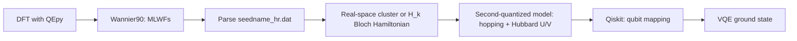

# QIS_QE

### Wannier-Downfolded Hamiltonians from Quantum ESPRESSO for Quantum Algorithms

[](LICENSE)

A pipeline that takes a **DFT calculation from Quantum ESPRESSO (via QEpy)**,
builds **maximally localized Wannier functions (MLWFs)** with **Wannier90**,
and turns the resulting tight-binding Hamiltonian into a **qubit operator**
via **Qiskit Nature** — for use as a starting point in quantum-algorithm
experiments (VQE and friends) on small correlated models derived from real
materials.

**Scope, honestly stated:** the qubit counts current NISQ-era algorithms and
simulators can handle (tens of qubits) limit this to small active spaces —
a handful of Wannier orbitals around the Fermi level, a defect cluster, or a
molecular fragment — not full unit cells of "large materials". See
[Limitations](#limitations--known-caveats) below.

---

## Workflow



## What's implemented

- **QEpy-driven SCF/NSCF → Wannier90 pipeline** (`wannierize_qepy.py`): writes
  the `.win` file from the QEpy driver's lattice/k-points, runs
  `wannier90.x -pp` → `pw2wannier90.x` → `wannier90.x`, and returns
  `seedname_hr.dat`. Requires QE, Wannier90, and QEpy installed and on
  `PATH` (see [Installation](#installation)) — this part has not been run
  end-to-end against a shipped example in this repo yet.
- **hr.dat parsing** (`ham_builder.read_wannier90_hr`) with strict validation:
  a mismatch between the number of R-vectors and Wigner-Seitz degeneracy
  weights raises instead of silently dropping the weights.
- **k-space Bloch Hamiltonian** `H(k) = Σ_R e^{i2πk·R} H(R)`
  (`kspace_hamiltonian`), with an explicit Hermiticity check: deviations
  above tolerance raise a warning (with the deviation size) instead of being
  silently symmetrized away.
- **Real-space cluster/supercell builder** (`build_cluster_hamiltonian`):
  assembles a finite many-orbital Hamiltonian directly from the H(R) hopping
  blocks, `H[(m,cell_a),(n,cell_b)] = H_mn(cell_b − cell_a)`, with either
  periodic (folded supercell) or open (finite cluster) boundary conditions
  per axis. This is the physically correct way to build an interacting
  problem on real Wannier sites — see
  [Limitations](#limitations--known-caveats) for why building it from a
  single H(k) instead is usually *not* meaningful.
- **Second-quantized model builder** (`fermionic_from_Hk` /
  `fermionic_from_cluster`): one-body hopping, onsite Hubbard `U`,
  nearest-neighbor `V` (with duplicate-bond guarding — `(i,j)` and `(j,i)`
  are the same bond and are no longer double-counted), chemical potential,
  and an optional documented double-counting correction
  (`ModelSpec.dc_scheme="fll"` or `"amf"`, see `double_counting_shift`).
- **Qubit mapping**: Jordan–Wigner, parity (with a correctly wired two-qubit
  reduction via `num_particles`), or Bravyi–Kitaev.
- **VQE**, via either a particle-number penalty (`penalize_number` +
  hardware-efficient ansatz) or a number-conserving UCCSD ansatz
  (`build_uccsd_ansatz` — read its docstring caveat about basis choice before
  using it on a Wannier Hamiltonian).
- **Validation**: `benchmarks/h_chain_benchmark.py` checks the real-space
  cluster builder against the k-space Bloch Hamiltonian on a toy chain, and
  compares VQE against exact diagonalization on a small Hubbard dimer. See
  [Validation](#validation) below.

## Roadmap / not yet implemented

These appeared in earlier drafts of this README as if shipped; they are not,
and are listed here instead so the gap is explicit:

- **Ab initio Coulomb integrals** over the Wannier functions (`coulomb.py` is
  a scaffold with a documented `NotImplementedError` — it needs UNK real-space
  grids and the Wannier90 U-matrix, neither of which is parsed yet). Until
  this exists, `ModelSpec.U`/`V_nn` are hand-set model parameters, not DFT
  output — see [Limitations](#limitations--known-caveats).
- **Constrained RPA (cRPA)** for a screened U, built on top of the above.
- **EOM-VQE / subspace VQE / Trotter time evolution** — sketched as
  unexecuted imports in `QE_qiskit.ipynb`, not a working code path.
- **Execution on real quantum hardware** (IBM/IonQ/Quantinuum) — not
  connected; everything currently runs on Qiskit's local simulators.
- **UCCSD in the correct (eigenbasis-rotated) basis** for Wannier
  Hamiltonians — see the caveat in `ham_builder.build_uccsd_ansatz`.

## Validation

`benchmarks/h_chain_benchmark.py` builds a synthetic 1-orbital nearest-neighbor
chain (so it runs without QE/Wannier90 installed) and checks two things:

1. **Band structure**: the real-space cluster builder, diagonalized on an
   8-cell periodic supercell, reproduces the k-space Bloch Hamiltonian
   sampled at the same supercell's allowed k-points to numerical precision.
2. **Interacting ground state**: for a 2-site Hubbard dimer (`U = 4|t|`), VQE
   (particle-number-penalized, hardware-efficient ansatz) matches exact
   diagonalization to ~1e-3|t|.


Run it yourself: `python benchmarks/h_chain_benchmark.py`.

## Limitations & known caveats

- **U/V are model parameters, not ab initio values.** They are hand-set
  Hubbard-like couplings on top of a DFT-derived tight-binding model, i.e.
  "Wannier tight-binding + model interaction," not a first-principles
  interacting Hamiltonian. See the Roadmap above for what closing this gap
  requires.
- **No double-counting correction is applied by default.** The DFT hoppings
  already contain a mean-field estimate of the interaction (via Hartree +
  exchange-correlation), so adding `U` on top without correcting for that
  double-counts part of it. `ModelSpec.dc_scheme` implements the two standard
  corrections (FLL, AMF; Anisimov et al., PRB 48, 16929 (1993)) — pick one and
  supply `dc_n0` (the nominal DFT occupation per spin-orbital) explicitly;
  there is no safe default to fall back on silently.
- **Building the many-body problem from a single H(k) is usually not
  meaningful.** `fermionic_from_hr`/`fermionic_from_Hk` fold every periodic
  image's hopping into one cell's orbitals; adding a local `U` there is only
  physically sensible if that "cell" already *is* the full interacting region
  you intend (e.g. Γ-point on a hr.dat that already describes a large defect
  supercell). For a primitive-cell hr.dat, or any non-Γ k, use
  `build_cluster_hamiltonian` + `fermionic_from_cluster` instead — it builds
  an explicit real-space cluster with boundary conditions you choose.
- **UCCSD/HartreeFock assume the input orbitals are already the mean-field
  eigenbasis.** Wannier orbitals are a localized basis, not that eigenbasis;
  using `build_uccsd_ansatz` directly on a Wannier Hamiltonian can converge to
  the wrong state (this was hit and diagnosed while building the benchmark
  above). Rotating the one-body Hamiltonian to its eigenbasis first — and the
  interaction tensor along with it — is on the roadmap; until then, prefer the
  particle-number-penalty approach for Wannier-basis problems.
- **Unscreened, even once implemented, is not "correct."** A direct Coulomb
  integral over Wannier functions ignores screening from the rest of the
  electrons, typically overestimating `U` by a factor of a few for
  correlated d/f-like orbitals. Treat it as an upper bound / starting point,
  not a final answer, until a cRPA (or similar) screening calculation is
  wired up.

## Installation

```bash
pip install -r requirements.txt   # or: pip install -e .
```

`qiskit`, `qiskit-nature`, and `qiskit-algorithms` are pinned to a
combination that's actually been run together (newer `qiskit` releases
changed the `Estimator` primitive interface in a way that breaks
`qiskit-algorithms<0.4`'s `VQE`) — see `requirements.txt` for the exact
constraint if you need to move off it.

The Wannierization step (`wannierize_qepy.py`) additionally requires, on
`PATH` and installed separately (not on PyPI):
- [Quantum ESPRESSO](https://www.quantum-espresso.org/) (`pw.x`,
  `pw2wannier90.x`) and [QEpy](https://gitlab.com/QEF/qepy) bindings
- [Wannier90](http://www.wannier90.org/) (`wannier90.x`)

Run the tests (no QE/Wannier90/QEpy needed — they use synthetic tight-binding
data):

```bash
pip install -e ".[dev]"
pytest
```

## License

[MIT](LICENSE)
